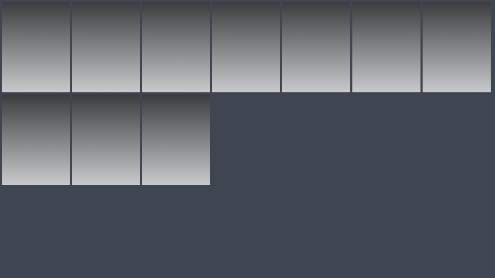

# Lutris Grid Art Downloader

 

Simple script to download and crop Steam Grid art for your Lutris library.

## Quick Start

1. Clone the repository and navigate to the project directory:
   ```bash
   git clone https://github.com/luiisca/lutris-gridder.git
   cd lutris-gridder
   ```

2. Set up a Python environment:
   ```bash
   python3 -m venv my-venv
   source my-venv/bin/activate
   pip install -r requirements.txt
   ```

3. Run the script:
   ```bash
   python src/art_downloader.py
   ```

4. Enter your SteamGridDB API key when prompted.

5. Select your preferences:
    - Banner (460x215) or Vertical (600x900) art
    - Auto or Manual selection mode
    - Replace all existing images or download new ones only

6. Restart Lutris to see the changes.

## Features

- Downloads game art from SteamGridDB
- Supports both banner and vertical cover art
- Auto-crops images to correct aspect ratio
- Preview final images before selecting
- Skip games that already have art
