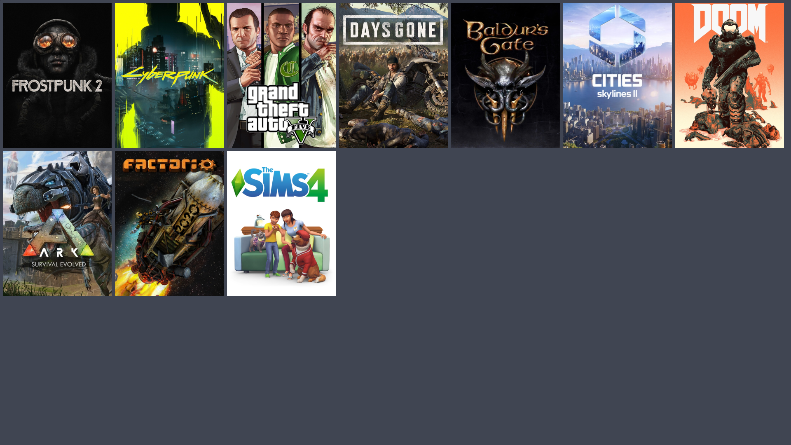

# Lutris Grid Art Downloader

 

Simple script to download and crop Steam Grid art for your Lutris library.

## Quick Start

1. Download `lutris-gridder` from the [latest release](https://github.com/luiisca/lutris-gridder/releases/latest)

2. Make executable:
```bash
chmod +x lutris-gridder
```

3. Run:

```bash
./lutris-gridder
```

4. Enter your SteamGridDB API key when prompted
5. Select your preferences:
    - Banner (460x215) or Vertical (600x900) art
    - Auto or Manual selection mode
    - Replace all existing images or download new ones only

6. Restart Lutris to see the changes

## Features

- Downloads game art from SteamGridDB
- Supports both banner and vertical cover art
- Auto-crops images to correct aspect ratio
- Preview final images before selecting
- Skip games that already have art
